# 리눅스의 기본 명령어

* * *

### 목차

1. [기본 명령어](#01)

2. [파일과 디렉터리](#02)

3. [디렉터리 명령어](#03)

4. [디렉터리 리스트](#04)

5. [파일 내용 출력](#05)

6. [C언어 파일 만들어 실행하기](#HW)

* * *

<h2 id="01">01.기본 명령어</h3>

- 날짜 및 시간 확인 :  `$ date`   
  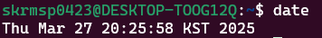<br /><br />
    
- 시스템 정보 확인 :   `$ hostname` `$ uname` `$ uname -a`   
  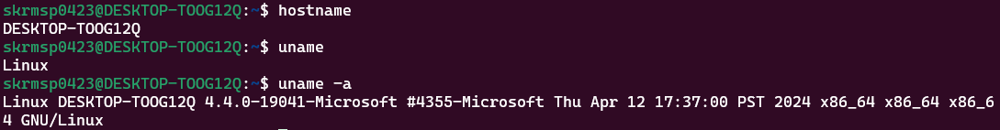<br /><br />
    
- 사용자 정보 확인 :   `$ whoami`   
  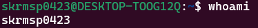<br /><br />

- 디렉터리 내용 확인 :   `$ ls`   
  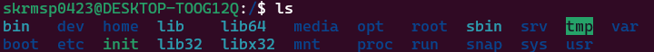<br /><br />

- 패스워드 변경 :   `$ passwd`   
  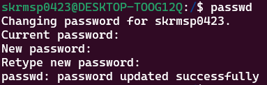<br /><br />

- 화면 정리 :   `$ clear`   
     
  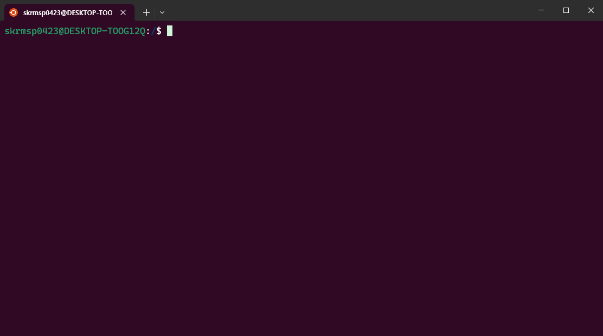<br /><br />

- 온라인 매뉴얼 :   `$ man (명령어)`   
  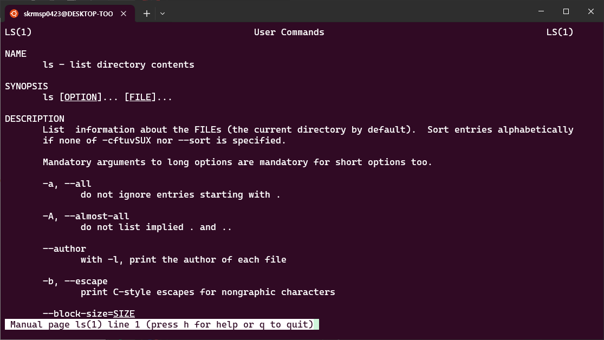<br /><br />

- 명령어에 대한 간단한 설명 :   `$ whatis (명령어)`   
  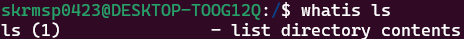<br /><br />
    
* * *

<h2 id="02">02. 파일과 디렉터리</h3>

- 파일의 종류
  
  - 일반 파일 (ordinary file)
    - 데이터를 가지고 있으면서 디스크에 저장됨.
    - 텍스트 파일, 이진 파일

  - 디렉터리 (directory) 또는 폴더 (folder)
    - 파일들을 계층적으로 조직화하는 데 사용되는 일종의 특수 파일
    - 디렉터리 내에 파일이나 서브디렉터리들이 존재함.

  - 장치 파일(device special file)
    - 물리적인 장치에 대한 내부적인 표현
    - 키보드 (stdin), 모니터 (stdout), 프린터 등도 파일처럼 사용함.

  - 심볼릭 링크 파일
    - 어떤 파일을 가리키는 또 하나의 경로명을 저장하는 파일

- 디렉터리 계층구조
  - 리눅스의 디렉터리는 루트로부터 시작하여 트리 형태의 계층구조를 이룸.   
  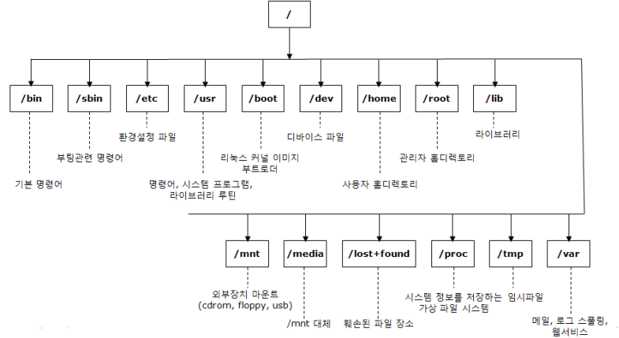

- 홈 디렉터리
  - 각 사용자마다 별도의 홈 디렉터리가 있음.
  - 사용자가 로그인하면 홈 디렉터리에서 작업을 시작함.
  ```
    ~  : 홈 디렉터리
    .  : 현재 디렉터리
    .. : 부모 디렉터리
  ```

- 경로명
  - 파일이나 디렉터리에 대한 정확한 이름
  - 절대 경로명 (absolute pathname)
    - 루트 디렉터리로부터 시작하여 경로 이름을 정확하게 적는 것
  - 상대 경로명 (relative path name)
    - 현재 작업 디렉터리부터 시작해서 경로 이름을 적는 것

- 명령어의 경로 확인 : `$ which 명령어`   
  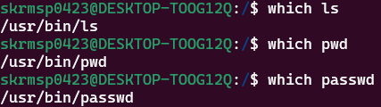

* * *

<h2 id="03">03. 디렉터리 명령어</h3>

- 현재 작업 디렉터리 출력 : `$ pwd`   
  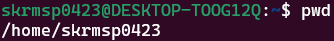

- 디렉터리 이동 : `$ cd (디렉터리)`   
  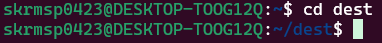

- 디렉터리 생성 : `$ mkdir [-p] (디렉터리)`   
  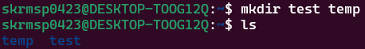   
  - 중간 디렉터리 자동 생성 옵션 : `-p`
    - 필요한 경우에 중간 디렉터리를 자동으로 만들어 줌.   
  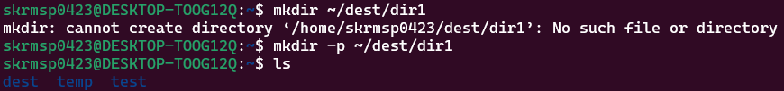

- 디렉터리 삭제 : `$ rmdir (디렉터리)`   
  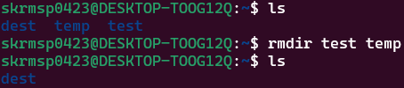   

* * *

<h2 id="04">04. 디렉터리 리스트</h3>

- 디렉터리 리스트 : `$ ls`
  - 지정된 디렉터리의 내용을 리스트 한다. 디렉터리를 지정하지 않으면 현재 디렉터리 내용을 리스트한다. 또한 파일을 지정하면 해당 파일만을 리스트 한다.   
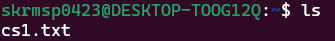

```
skrmsp0423@DESKTOP-TOOG12Q:~$ ls
cs1.txt
```

- ls 명령어 옵션
  
  |옵션|기능|
  |---|---|
  |-a|숨겨진 파일을 포함하여 모든 파일을 리스트함|
  |-s|파일의 크기를 K 바이트 단위로 출력함|
  |-l|파일의 상세 정보를 출력함|
  |-F|파일의 종류를 표시하여 출력함|
  |-R|모든 하위 디렉터리들을 리스트함|

  - size 옵션 : `$ ls -s`   
    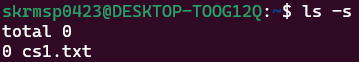   
    
  - all 옵션 : `$ ls -a`   
    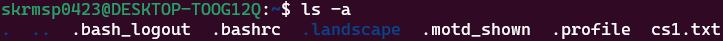   
    
  - 파일 속성 출력 : `$ ls -l`   
    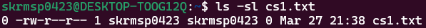
    - total 부터 차례대로 블록 수, 파일 종류, 접근권한 , 링크 수, 소유자명, 그룹명, 파일 크기, 최종 수정 시간, 파일 이름이다.
    
  - `$ ls -asl`
    - 숨겨진 파일을 포함한 모든 파일의 상세 정보와 크기를 출력      
    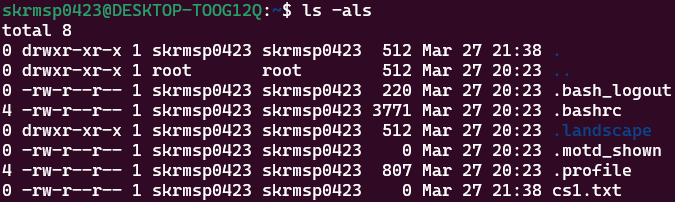
  
  - `$ ls -F`
    - 기호로 파일의 종류를 표시   
    ```
    * : 실행파일
    / : 디렉터리
    @ : 심볼릭 링크
    ```   
    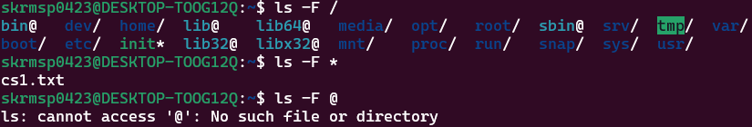

  - Recursive 옵션 : `$ ls -R`
    - 모든 하위 디렉터리 내용을 리스트 함.    
    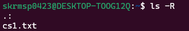
    
* * *

<h2 id="05">05. 파일 내용 출력</h3>

- 간단한 파일 만들기 : `$ gedit`
  - GNOME 이 제공하는 GUI 기반 문서편집기

  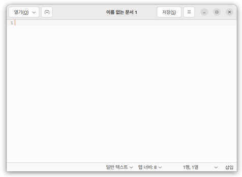

  - 사용법
    - [프로그램] -> [보조 프로그램] -> [텍스트 편집기]
    - `$ gedit [파일이름]`

  - 기능
    - 파일 : 새로 만들기, 열기, 저장, 닫기
    - 편집 : 입력 취소, 잘라내기, 복사, 붙여넣기
    - 보기 : 도구 모음, 상태표시줄, 전체화면
    - 검색 : 찾기, 바꾸기
    - 검사 : 맞춤법 검사
    - 문서 : 모두 저장, 모두 닫기
    - 도움말

- 간단한 파일 만들기 : `$ cat`
  - 표준입력 내용을 모두 파일에 저장한다. 파일이 없으면 새로 만든다.
  - 첫 줄부터 작성하며 줄 바꿈 이후에 이전 줄은 수정 못 한다.
```
skrmsp0423@DESKTOP-TOOG12Q:~$ cat > cs1.txt
...
skrmsp0423@DESKTOP-TOOG12Q:~$ ls
cs1.txt
```   
   
- 간단한 파일 만들기 : `$ touch`
  - 파일 크기가 0인 이름만 있는 빈 파일을 만들어 준다.
```
skrmsp0423@DESKTOP-TOOG12Q:~$ touch cs2.txt
skrmsp0423@DESKTOP-TOOG12Q:~$ ls
cs1.txt  cs2.txt
```   
   
  - 파일 수정 시간을 현재 시간으로 수정한다.
```
skrmsp0423@DESKTOP-TOOG12Q:~$ ls -l
total 0
-rw-r--r-- 1 skrmsp0423 skrmsp0423 4 Mar 27 22:04 cs1.txt
-rw-r--r-- 1 skrmsp0423 skrmsp0423 0 Mar 27 22:08 cs2.txt
skrmsp0423@DESKTOP-TOOG12Q:~$ touch cs1.txt
skrmsp0423@DESKTOP-TOOG12Q:~$ ls -l
total 0
-rw-r--r-- 1 skrmsp0423 skrmsp0423 4 Mar 27 22:10 cs1.txt
-rw-r--r-- 1 skrmsp0423 skrmsp0423 0 Mar 27 22:08 cs2.txt
```

- 파일 내용 출력
  - cat, more, head, tail, wc 등
```
$ 명령어 파일
$ 명령어 파일*
```

- 파일 내용 보기 : `$ cat`
  - 파일(들)의 내용을 그대로 화면에 출력. 파일을 지정하지 않으면 표준입력 내용을 그대로 화면에 출력.
```
skrmsp0423@DESKTOP-TOOG12Q:~$ cat cs1.txt
...
```

```
skrmsp0423@DESKTOP-TOOG12Q:~$ cat
Hello World !
Hello World !
Bye!
Bye!
```

- 페이지 단위로 파일 내용 보기 : `$ more`
  - 파일(들)의 내용을 페이지 단위로 화면에 출력.

- 파일 앞부분보기 : `$ head`
  - 파일(들)의 앞부분을 화면에 출력. 파일을 지정하지 않으면 표준입력 내용을 대상을 함

- 파일 뒷부분보기 : `$ tail`
  - 파일(들)의 뒷부분을 화면에 출력. 파일을 지정하지 않으면 표준입력 내용을 대상으로 함

- 단어 세기 : `$ wc`
  - 파일에 저장된 줄(l), 단어(w), 문자(c)의 개수를 세서 출력. 파일을 지정하지 않으면 표준입력 내용을 대상으로 함.

* * *

<h2 id="HW">C언어 파일 만들어 실행하기</h3>
 - 학번과 이름을 입력받아 출력하는 C언어 파일 작성하기.

1. `cat`을 이용해 파일 생성
```
skrmsp0423@DESKTOP-TOOG12Q:~$ cat > mission.c
#include <stdio.h>

int main() {
	char num[100];
	char name[100];

	printf("학번을 입력하시오. : ");
	scanf("%s", num);

	printf("이름을 입력하시오. : ");
	scanf("%s", name);

	printf("학번 :%s, 이름 : %s\n", num, name);
}
```

2. 리눅스에 gcc 설치하기
   - apt 업데이트하기
   ```
   skrmsp0423@DESKTOP-TOOG12Q:~$ sudo apt update
   ```
   
   - gcc 설치하기
   ```
   skrmsp0423@DESKTOP-TOOG12Q:~$ sudo apt install gcc
   ```
   
4. 실행
   - C 파일 컴파일하기
   ```
   skrmsp0423@DESKTOP-TOOG12Q:~$ gcc mission.c -o mission
   ```
  
   - C 파일 실행하기
   ```
   skrmsp0423@DESKTOP-TOOG12Q:~$ ./mission
   학번을 입력하시오. : 2023864019
   이름을 입력하시오. : 김현진
   학번 :2023864019, 이름 : 김현진
   ```

> WSL 로 리눅스를 사용하는 경우 윈도우의 파일 탐색기에서 Linux 의 파일들을 확인할 수 있다.
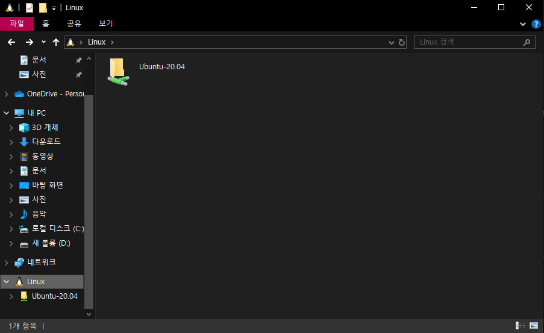
