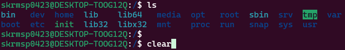

# 리눅스의 기본 명령어

* * *

### 목차

1. [기본 명령어](#01)

2. [파일과 디렉터리](#02)

3. 디렉터리 명령어

4. 디렉터리 리스트

5. 파일 내용 출력

* * *

<h3 id="01">01.기본 명령어</h3>

- 날짜 및 시간 확인 :  `$ date`   
    
    
- 시스템 정보 확인 :   `$ hostname` `$ uname` `$ uname -a`   
    
    
- 사용자 정보 확인 :   `$ whoami`   
    

- 디렉터리 내용 확인 :   `$ ls`   
    

- 패스워드 변경 :   `$ passwd`   
    

- 화면 정리 :   `$ clear`   
     
    

- 온라인 매뉴얼 :   `$ man (명령어)`   
    

- 명령어에 대한 간단한 설명 :   `$ whatis (명령어)`   
    
    
* * *

<h3 id="02">02.파일과 디렉터리</h3>

- 파일의 종류
  
  - 일반 파일 (ordinary file)
    - 데이터를 가지고 있으면서 디스크에 저장됨.
    - 텍스트 파일, 이진 파일

  - 디렉터리 (directory) 또는 폴더 (folder)
    - 파일들을 계층적으로 조직화하는 데 사용되는 일종의 특수 파일
    - 디렉터리 내에 파일이나 서브디렉터리들이 존재함.

  - 장치 파일(device special file)
    - 물리적인 장치에 대한 내부적인 표현
    - 키보드 (stdin), 모니터 (stdout), 프린터 등도 파일처럼 사용

  - 심볼릭 링크 파일
    - 어떤 파일을 가리키는 또 하나의 경로명을 저장하는 파일

- 디렉터리 계층구조

- 홈 디렉터리

- 경로명

- 명령어의 경로 확인 : `$ which 명령어`
